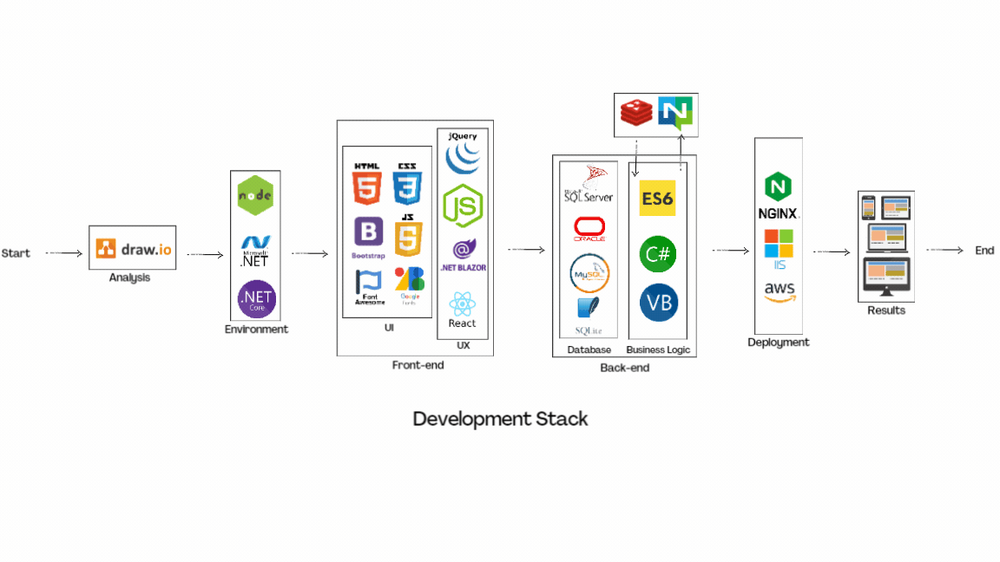

 

<h1 align="center">Hi 👋, I'm Muhammad Zakaria</h1>  
<h3 align="center">a fullstack developer from Pakistan</h3>  
  

  
  
  

  
  
  
- 🌱 I’m currently learning **React, Angular**  
  
- 💬 Ask me about **dotnet, javascript, jquery, sql**  
  
- 📫 How to reach me **muhammadzakaria616@gmail.com**  
  
- 📄 Know about my experiences [https://zakk616.github.io/resume/](https://zakk616.github.io/resume/)  
  
<h3 align="left">Connect with me:</h3>  

  
  
  
  

  
  
<h3 align="left">Languages and Tools:</h3>  

                        
  
  

  
  

&nbsp;
  
  

